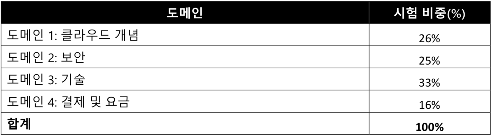

# AWS Certified Cloud Practitioner 자격증에 대한 이해

1. AWS 에서 해당 자격증에 대한 가이드 문서를 아래와 같이 제공하고 있다.

    - <https://aws.amazon.com/certification/certified-cloud-practitioner/>
    - <https://d1.awsstatic.com/training-and-certification/docs-cloud-practitioner/AWS_Certified_Cloud_Practitioner_Exam_Guide_v2.1.pdf>

2. Cloud Practitioner 자격증을 통한 능력 검증 (AWS 홈페이지에 명시되어 있음)
    - AWS 클라우드와 기본 글로벌 인프라가 무엇인지 정의
    - 기본 AWS 클라우드 아키텍처 원칙을 설명
    - AWS 클라우드 가치 제안을 설명
    - AWS 플랫폼의 주요 서비스 및 관련 일반 사용 사례를 설명(예: 컴퓨팅, 분석 등)
    - AWS 플랫폼의 기본 보안 및 규정 준수 측면과 공동 보안 모델을 설명
    - 결제, 계정 관리 및 요금 모델을 정의
    - 설명서 또는 기술 지원 소스를 식별(예: 백서, 지원 티켓 등)
    - AWS 클라우드에서 배포 및 운영할 때의 기본/주요 특성 설명

3. 시험 점수
    - 100점 ~ 1000점
    - 700점 이상 맞아야 패스

4. 문제 출제 영역

    가이드 문서에 명시된 문제 출제 영역 및 비중은 다음과 같다.

    

    - Domain 1: Cloud Concepts
      - 1.1 Define the AWS Cloud and its value proposition
      - 1.2 Identify aspects of AWS Cloud economics
      - 1.3 List the different cloud architecture design principles
    - Domain 2: Security and Compliance
      - 2.1 Define the AWS shared responsibility model
      - 2.2 Define AWS Cloud security and compliance concepts
      - 2.3 Identify AWS access management capabilities
      - 2.4 Identify resources for security support
    - Domain 3: Technology
      - 3.1 Define methods of deploying and operating in the AWS Cloud
      - 3.2 Define the AWS global infrastructure
      - 3.3 Identify the core AWS services
      - 3.4 Identify resources for technology support
    - Domain 4: Billing and Pricing
      - 4.1 Compare and contrast the various pricing models for AWS
      - 4.2 Recognize the various account structures in relation to AWS billing and pricing
      - 4.3 Identify resources available for billing support