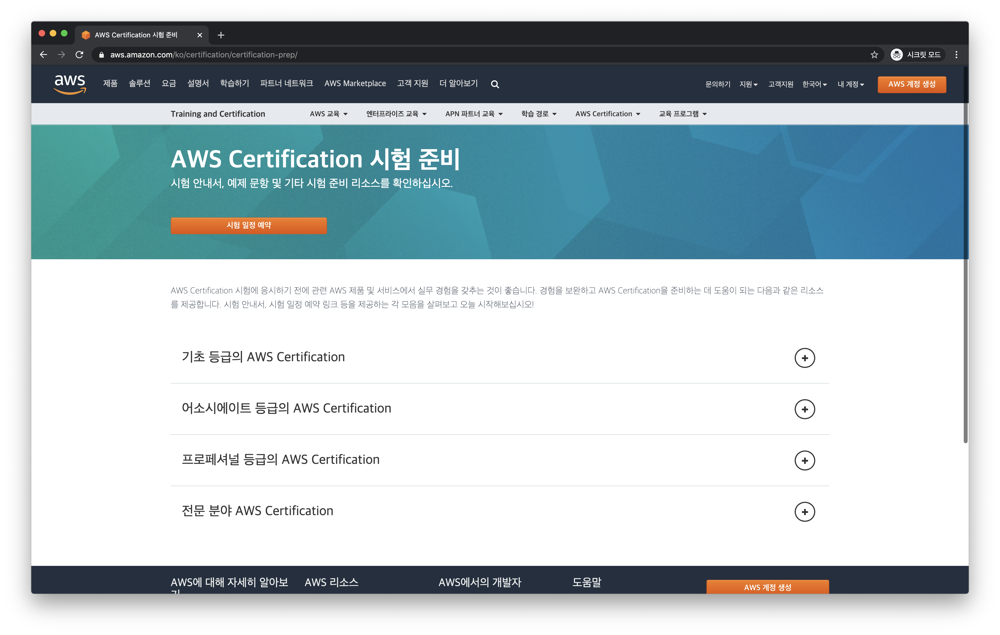
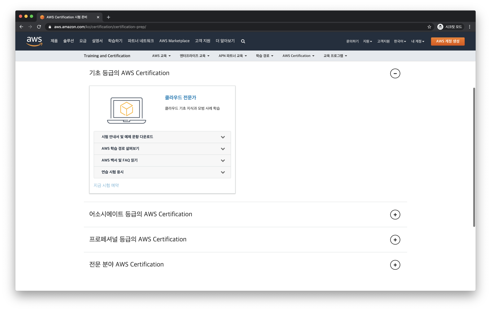
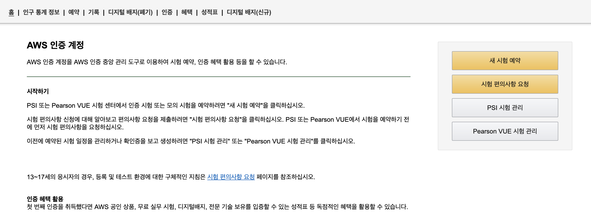
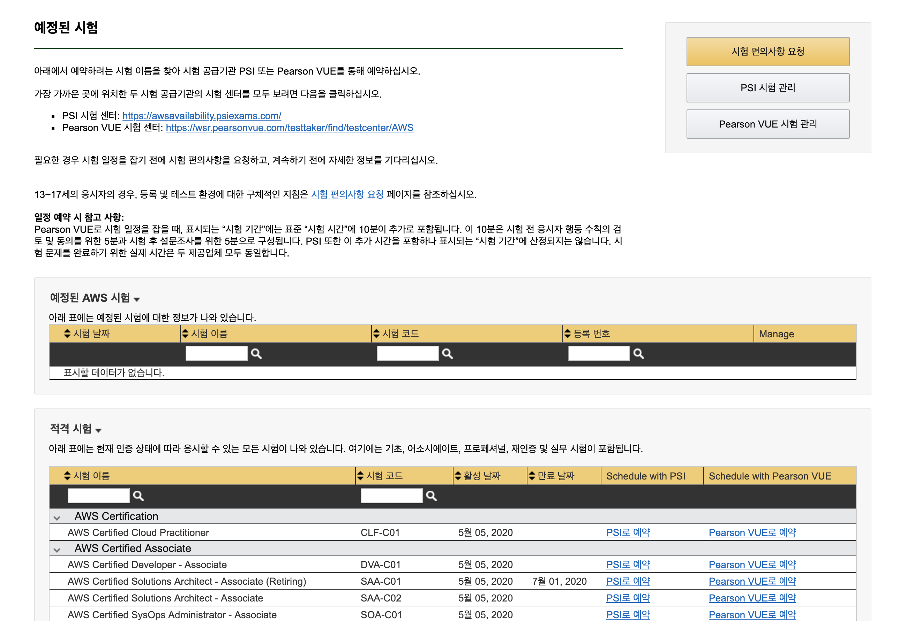
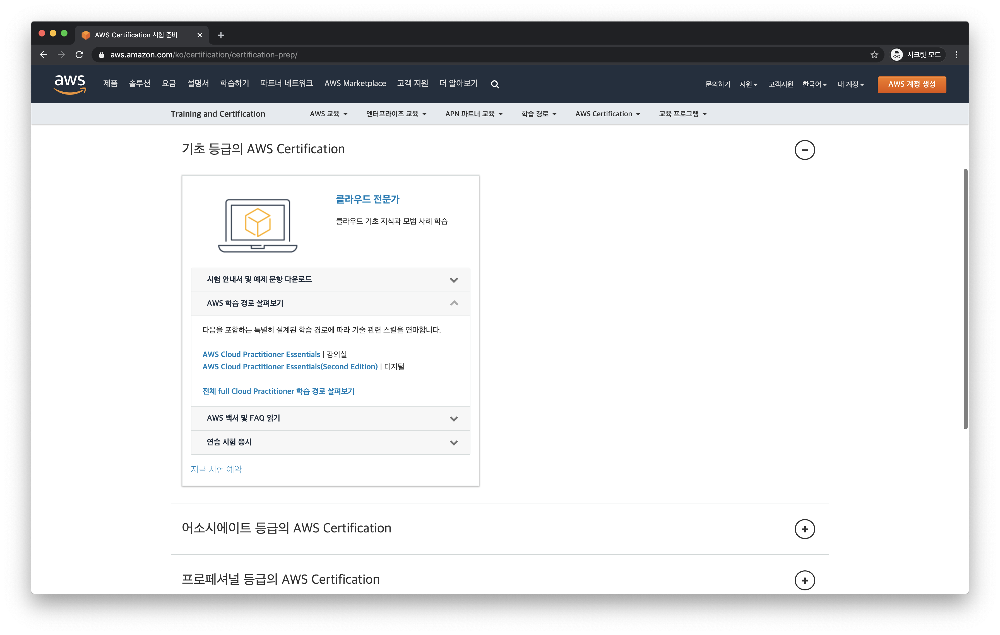
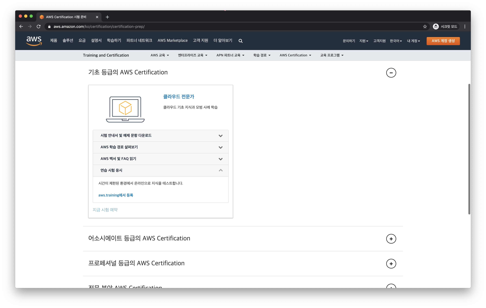
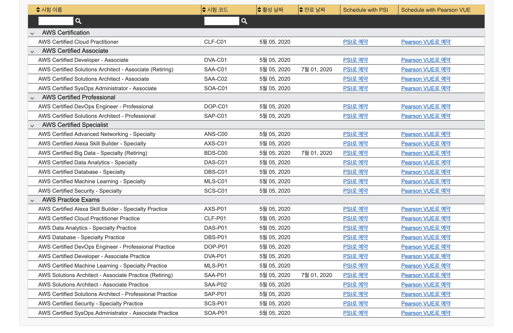

# 후기

## 시험예약

### 1. AWS Certification 사이트

https://aws.amazon.com/ko/certification/certification-prep/

- '기초등급의 AWS Certification' 선택
- 기초등급에는 '클라우드 전문가' 1개만 있음
- '지금 시험 예약'을 선택

  

- 신규 페이지로 이동
- 언어를 한국어로 변경
- '새 시험 예약' 선택

  

- 시험 목록에서 'AWS Certified Cloud Practitioner' 확인
- 'Pearson VUE' or 'PSI' 선택해서 진행

  

> 'Pearson VUE' or 'PSI' 어느 곳에서 시험을 신청해도 상관없다. PSI보다는 Pearson VUE가 시험장소가 많은 것 같다.

### 2. 자격증 신청 비용

AWS FAQ에 나와 있는 공식 답변이다.
- 클라우드 전문가 시험 비용은 100 USD
- 어소시에이트 등급 시험 비용은 150 USD
- 프로페셔널 등급 및 전문 분야 시험 비용은 300 USD
- 세금(부가가치세 등)이 적용될 수 있음

## 시험준비
    만점을 받기 위한 시험 공부는 아니지만 합격은 하였기 때문에 혹시라도 누군가에게 가이드가 될 수 있다는 생각으로 어떻게 준비하였는지 정리를 해보았음.
    
    시험 신청 후 3주 정도 공부를 하였으며, 퇴근후 여유시간에 공부를 했기 때문에 절대적인 시간은 부족했음

    온라인 강의 1회 듣기 : 1주 소요
    온라인 강의 2회 듣기 : 1주 소요
    AWS 사이트 읽어보기 : 1주 소요

### 1. 온라인 강의 듣기

위 사이트에서 'AWS Cloud Practitioner Essentials(Second Edition)' 강의를 2번 들었음 (한국어 자막제공)

> 백서도 제공하고 있지만 죄다 영어로 되어 있어서 빠른 포기를 하였음

처음 들을 때는 잘 이해 안가는 내용들이 많아서 우선 끝가지 들어보자라는 생각으로 모르는 내용이 나와도 그냥 넘어가면서 들었으며, 2번째에는 그래도 1번 들었다고 내용이 좀 이해되기 시작했음

> 온라인 강의는 꼭 한번 듣는 것을 추천함 전반적인 개념을 잡는데 도움이 됨

### 2. 연습시험 응시

'연습 시험 응시' -> 'aws.training에서 등록'을 선택하면 위에서 시험을 등록한 사이트로 이동을 하게 됨 

'새 시험 예약' 을 동일하게 선택해서 제공되는 시험목록을 보면 아래에 'AWS Practice Exams'에 있는 'AWS Certified Cloud Practitioner Practice' 을 선택하면 연습시험을 응시 할 수 있다.

> 연습 시험도 공짜는 아니고 '22,800원' 이라는 응시비용이 든다.

온라인 강의를 2번 듣고 바로 연습시험을 응시하였는데, 온라인 강의로는 부족하다는 사실만 깨달았다. 지금 생각해보면 '22,800원' 이라는 비용의 가치는 없다고 느껴진다. 

### 3. AWS 사이트 읽어보기

처음에는 온라인 교육에서 언급되지 않은 AWS의 모든 service를 보려는 큰 포부를 가지고 있었으나, 제공되는 Service가 너무 많아서 AWS 사이트에 주요 서비스라고 분류된 서비스만 읽어보고 나머지 시간에는 '요금'과 '고객지원' 부분을 주로 읽었다.

> '요금'과 '고객지원'은 시험 출제 영역으로 분류되어 있는 항목이다.

## 시험응시 및 결과확인

### 1. 시험 난이도

연습시험에서 85%의 점수를 획득했었기 때문에, 패스는 하겠지..라는 안이한 생각으로 시험을 봤는데, 문제를 절반 정도 확인하고 나서부터는 이러다가 떨어지는거 아닌가? 라는 불안감이 생겼다.

문제를 직접 언급은 할 수 없지만, 중요하지 않다고 생각해서 내용을 전혀 확인하지 않은 서비스에 대한 문제도 상당히 나왔으며, 서비스의 spec에 대해서 상세하게 물어보는 문제들이 많이 있어서, 서비스들에 대한 개념만 알고 시험을 보면 당황스러울 수 있을 것 같다.

솔직히 이 자격증은 완전 기초라고 생각을 했고, 대충 공부해도 문제 없을 거라고 생각했었다. 그런데 생각보다 전반적으로 봐야 할 내용들이 많아서 나 처럼 시험을 보면서 불안하지 않고 싶다면, 조금 더 시간을 들여서 공부하기를 추천한다. 어중간하게 공부해서 $100을 날리면 상당히 아까울 것 같다.

### 2. 결과 확인

합격할 수 있을지 자신은 없었는데, 다행히 합격을 하였고 총 점수는 1000점 만점에 860점을 맞았다. 자신없이 푼 문제들이 많았는데 운이 좋았다고 생각한다.

> 시험을 종료하면 결과를 화면에서 바로 확인할 수 있고, 점수는 나중에 aws 사이트에서 확인 가능하다.

